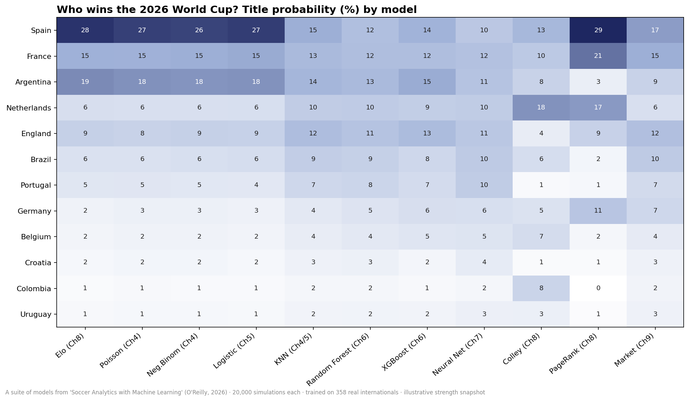
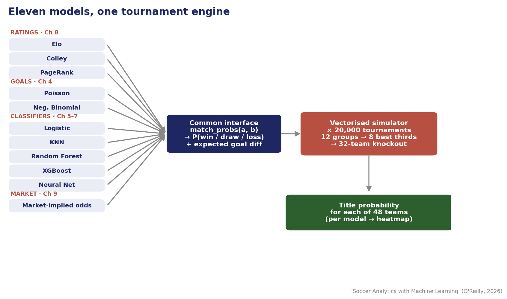

# Who Wins the 2026 World Cup? Eleven Models, One Tournament

[](LICENSE)
[](data/SOURCES.md)

A small, transparent suite of forecasting models that each simulate the **2026 FIFA World Cup** and predict who lifts the trophy — built with the methods from the O'Reilly book **[*Soccer Analytics with Machine Learning*](#book)**.

Eleven models, one for (almost) every chapter of the book, are run through the same tournament simulator. They crown **four different champions** — and that disagreement is the point.



## The result (20,000 simulations per model)

| Team | Consensus | Range across models |
|------|----------:|--------------------:|
| Spain | **20.2%** | 13–29% |
| France | 14.0% | 10–21% |
| Argentina | 13.7% | 3–19% |
| Netherlands | 9.7% | 6–18% |
| England | 9.4% | 3–13% |

Each model's outright pick: **Spain** (Elo, Poisson, Negative Binomial, logistic, KNN, PageRank), **Argentina** (random forest, XGBoost), **France** (neural net), **Netherlands** (Colley).

> ⚠️ The team-strength ratings and market odds in the code are an **illustrative snapshot** — refresh them before relying on the numbers (see [`data/SOURCES.md`](data/SOURCES.md)).

## The models

| Model | Chapter | Idea |
|-------|---------|------|
| Elo / Colley / PageRank | 8 | Team ratings (form-based and results-graph) |
| Poisson / Negative Binomial | 4 | Goal-count models |
| Logistic regression | 5 | Win/draw/loss classifier |
| KNN | 4–5 | Prediction by nearest historical matchups |
| Random Forest / XGBoost | 6 | Tree ensembles |
| Neural network (MLP) | 7 | Small multilayer perceptron |
| Market-implied odds | 9 | Bookmaker odds → de-vigged probabilities (benchmark only) |

All eleven are reduced to a common `P(win/draw/loss)` interface and run through one vectorized simulator (12 groups → 8 best thirds → 32-team knockout).



## Quick start

```bash
pip install -r requirements.txt

python wc2026_simple_model.py    # the gentle intro: Elo + Poisson, one model
python wc2026_model_suite.py     # the full 11-model suite (set WC_N for #sims)
python make_charts.py            # comparison heatmap + consensus/range
python add_article_charts.py     # market-disagreement + CV-comparison charts
python build_article2_extras.py  # model-agreement heatmap + pipeline schematic
```

The notebook [`world_cup_2026_prediction.ipynb`](world_cup_2026_prediction.ipynb) walks through the single-model version step by step.

For **match win/draw/loss predictions** and a **goal-to-goal (exact-scoreline) analysis** — correct-score heatmaps, expected goals, most-likely results, over/under and BTTS, a **per-algorithm most-likely-scoreline table for all 72 group matches** (`group_match_scorelines.csv`), plus the consensus title simulation — see [`wc2026_match_and_scoreline_analysis.ipynb`](wc2026_match_and_scoreline_analysis.ipynb):

```bash
jupyter nbconvert --to notebook --execute --inplace wc2026_match_and_scoreline_analysis.ipynb
# or just open it in Jupyter and Run All. Regenerate the notebook with: python build_nb.py
```

**During the tournament**, [`wc2026_live_update.ipynb`](wc2026_live_update.ipynb) pulls the **actual 2026 results** (live from openfootball, public domain), shows current group standings, predicts the upcoming matches, resolves the **official knockout bracket** (Round of 32 → final) once the groups are decided, and re-computes every team's advance/title probability with a hybrid Monte Carlo (played results fixed, the rest simulated):

```bash
python refresh_data.py           # download the latest 2026 results -> data/wc2026_results.csv
jupyter nbconvert --to notebook --execute --inplace wc2026_live_update.ipynb
# Re-run both after each matchday. Regenerate the notebook with: python build_live_nb.py
```

For a full **ML/DL benchmark suite** — ~16 models (classics, five GBDTs, PyTorch DNN / FT-Transformer / TabNet) **auto-tuned with Optuna** (TPE + Hyperband) under RAM/VRAM guardrails, **validated against the already-played WM 2026 results** (auto-selected champion by WDL accuracy), then a Monte-Carlo of the 48-team tournament — see [`wc2026_advanced_gpu_benchmark_suite.ipynb`](wc2026_advanced_gpu_benchmark_suite.ipynb):

```bash
pip install optuna lightgbm catboost torch pytorch-tabnet psutil   # advanced-suite extras
jupyter nbconvert --to notebook --execute --inplace wc2026_advanced_gpu_benchmark_suite.ipynb
# CPU is fine (< 1 GB RAM, < 2 min). Regenerate with: python build_benchmark_nb.py
```

To **score the forecasts against reality**, [`wc2026_prediction_eval.ipynb`](wc2026_prediction_eval.ipynb) lines up the live notebook's per-match predictions chronologically against the real played results and reports the quality: win/draw/loss tendency hit-rate (✓/✗), exact-scoreline hit-rate, expected-goals (λ) error, plus Brier/log-loss and calibration charts:

```bash
jupyter nbconvert --to notebook --execute --inplace wc2026_prediction_eval.ipynb
# Uses results/*_next_matches.csv if present, else reproduces with the same model.
# Regenerate with: python build_eval_nb.py
```

## Repository layout

```
wc2026_simple_model.py      # single Elo + Poisson + Monte Carlo model
wc2026_model_suite.py       # the eleven-model suite
make_charts.py / add_article_charts.py / build_article2_extras.py  # figures
world_cup_2026_prediction.ipynb  # annotated notebook (single model)
wc2026_match_and_scoreline_analysis.ipynb  # win/draw/loss + goal-to-goal scoreline analysis + title sim
wc2026_live_update.ipynb    # in-tournament: live results, standings, knockout bracket, updated odds
wc2026_advanced_gpu_benchmark_suite.ipynb  # ~16-model ML/DL benchmark + Optuna tuning + Monte-Carlo
wc2026_prediction_eval.ipynb  # backtest: live forecasts vs real results (WDL/scoreline/lambda quality)
build_nb.py / build_live_nb.py / build_benchmark_nb.py / build_eval_nb.py   # rebuild the analysis notebooks
refresh_data.py             # download latest results from openfootball -> data/*.csv
data/                       # match data (public domain) + SOURCES.md
model_title_probabilities.csv, model_picks.csv, classifier_cv_metrics.csv  # results
*.png                       # generated figures
```

## Method, in one paragraph

Every team gets a strength rating. Each matchup is converted into win/draw/loss probabilities — by a Poisson goal model, a fitted classifier, or a rating curve, depending on the model. The whole 48-team tournament is then simulated 20,000 times and the champion tallied. The models are trained or computed on **358 real international matches** (World Cups 2010–2022 + Euros 2020/2024). Full write-ups are in the accompanying article series.

<a name="book"></a>
## 📘 From the book

This project applies the techniques from **[*Soccer Analytics with Machine Learning*](https://learning.oreilly.com/library/view/soccer-analytics-with/9781098181109/)** (O'Reilly, 2026) by Haipeng Gao, Ari Joury, Weining Shen, and Guanyu Hu — Poisson and regression models (Ch 4), classification (Ch 5), tree-based methods (Ch 6), neural networks (Ch 7), team ratings (Ch 8), and market/odds analysis (Ch 9).

- 📖 **Get the book:** [O'Reilly](https://learning.oreilly.com/library/view/soccer-analytics-with/9781098181109/)
- 🧑‍💻 **Companion code for the whole book** (with worked StatsBomb examples): [github.com/SoccerAnalyticsML/Soccer-Analytics-with-Machine-Learning](https://github.com/SoccerAnalyticsML/Soccer-Analytics-with-Machine-Learning)

If this repo was useful, the book is where you learn to build every one of these models from scratch.

## License

Code: [MIT](LICENSE). Data: public domain (see [`data/SOURCES.md`](data/SOURCES.md)).
